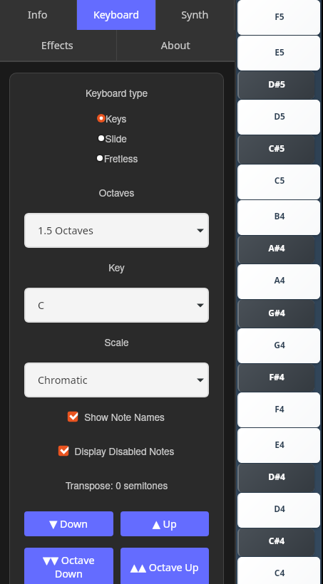

# Harphonium

## A performance-oriented synthesizer for your phone

A synthesizer app built with Tauri, React, Rust and FunDSP that runs on desktop
and Android.



Aren't there enough synths already? Well maybe, but I wanted one that:

- Has a piano-like keyboard layout
- Has the keyboard oriented vertically, as that's the more natural way to hold a
  phone
- Allows for disabling or removing of notes aren't in the currently selected
  scale (as it's really easy to fat-finger a phone keyboard)
- Allows the keyboard to be played like a regular piano keyboard, or more like a
  stylophone, with optional tuning constraint (So far only the piano mode is
  done)
- Acceptably low latency for live performance (it's currently OK but could
  probably be better)

Things I don't care so much about, which are nevertheless true:

- Runs on Android, Linux, and in theory Windows, MacOS and iOS. It's nice to be
  able to test on my laptop, but it's really intended for mobile devices.
- The UI is a React app that communicates with the synth backend via IPC. That
  makes for fairly accessible frontend development, without compromising the
  audio performance
- Android release apk is currently about 17Mb, which isn't spectacular or
  anything but it's a lot better than an Electron app would be

At the time of writing, I've done about three days of vibe coding on this. A lot
of stuff is done and it seems basically viable, but temper your expectations.

## Architecture

- **Frontend**: React + TypeScript + Vite
- **Backend**: Rust with Tauri framework
- **Audio**:
  - Desktop: `cpal` library for cross-platform audio
  - Android: `oboe` library for low-latency audio
  - [FunDSP](https://github.com/SamiPerttu/fundsp) for node-base synth creation
    in Rust
- **Build System**: Tauri v2 with mobile support

## Prerequisites

### For Desktop Development

- Node.js (18+)
- Rust (latest stable)
- System audio libraries (ALSA/PulseAudio on Linux)

### For Android Development

- All desktop prerequisites
- Android SDK (API level 24+)
- Android NDK (25.2.9519653 recommended)
- Java 17 JDK

## Environment Setup

### 1. Install Rust

See [https://rustup.rs](https://rustup.rs/)

### 2. Install Tauri CLI

```bash
cargo install tauri-cli --version "^2.0.0"
```

### 3. Android Development Setup

You'll need to install the Android development SDK, and set various paths, eg. I
have:

```bash
ANDROID_HOME=$HOME/Android/Sdk
NDK_HOME=$HOME/Android/Sdk/ndk/25.2.9519653
ANDROID_BUILD_TOOLS=$HOME/Android/Sdk/build-tools/36.0.0
JAVA_HOME=/usr/lib/jvm/java-17-openjdk-amd64
PATH=$PATH:$ANDROID_HOME/platform-tools:$ANDROID_HOME/tools
```

and probably some other stuff set elsewhere. Sorry, you'll have to figure this
out on your own.

At some point, you'll need to do

```bash
cargo tauri android init
```

to create the android project structure under `src-tauri/gen/android/`. There
are two files under `src-tauri/android/` that need to be copied to their
equivalent locations under the `src-tauri/gen/android` folder. This isn't
essential but the app won't run fullscreen otherwise.

### 4. Install Android Build Targets

```bash
rustup target add aarch64-linux-android armv7-linux-androideabi i686-linux-android x86_64-linux-android
```

### 5. Install Dependencies

```bash
cd harphonium
npm install
```

## Running the App

### Desktop Development

```bash
# Start development server with hot reload
cargo tauri dev

# Build desktop app
cargo tauri build
```

If you get symbol lookup errors in VS Code's integrated terminal, run the above
command from a regular terminal outside VS Code. This is due to VS Code snap
environment conflicts.

### Android Development

There are various handy commands in `dev.sh`, in the root of the project. Run it
with no arguments to see a list. For android development the most important one
is probably:

```bash
./dev.sh android-device-test
```

...which should build a debug apk, install it to your device, and run it. You
might need to do some setup first, turn on USB debugging etc. The command should
hand-hold you a bit for this.

To see Android logs:

```bash
# Monitor app logs
adb logcat | grep -E "(harphonium|Tauri)"

# Monitor audio-specific logs
adb logcat | grep -E "(oboe|audio|AudioStream)"
```

To get a working Android Virtual Device (AVD) for the emulator:

```bash
# List available system images
$ANDROID_HOME/cmdline-tools/latest/bin/sdkmanager --list | grep system-images

# Create AVD with API 36
$ANDROID_HOME/cmdline-tools/latest/bin/avdmanager create avd \
  -n Medium_Phone_API_36 \
  -k "system-images;android-36;google_apis;x86_64" \
  -d "pixel_7"
```
